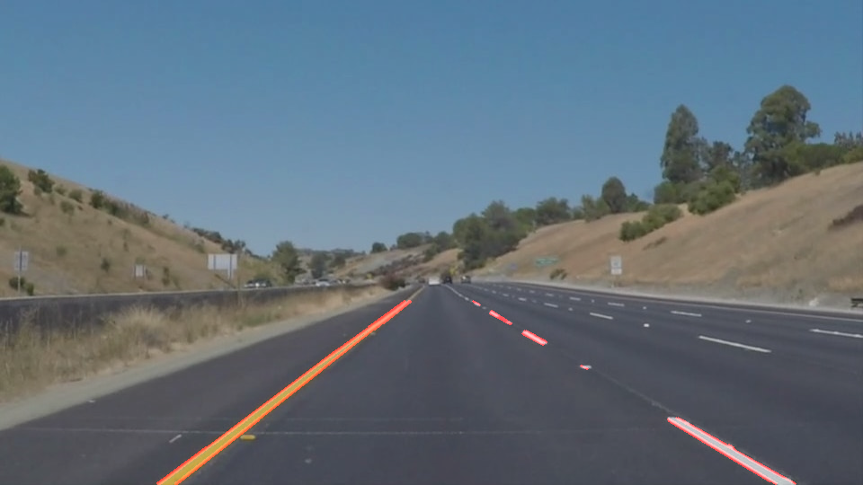
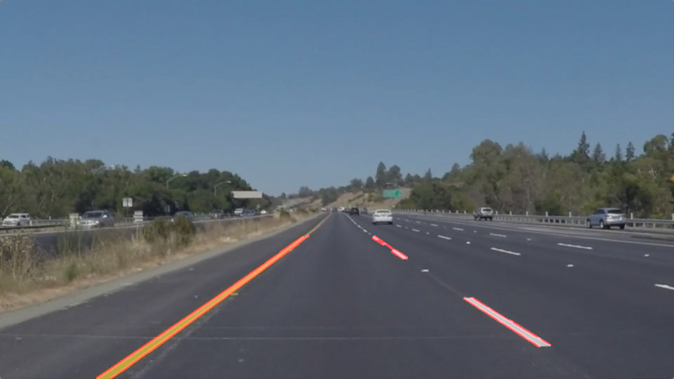

# **Finding Lane Lines on the Road** 

## Setup

Images of size 960 * 540 pixels were provided by Udacity.The task was to detect lane lines in those images as well as videos of which the images were a part of.
Here are some sample images-

## Pipeline

My pipeline consists of following steps-

1. Grayscaling
2. Gaussian Blur
3. Canny Transform
4. Region of interest identification through masking
5. Hough Trasform
6. Weight combination transformed image with original image.

The crux of the project was draw_lines function that was responsible for segregating left and right lane lines.I approached through the observation that the slope of the left and right lines had opposite signs in absence of curvature(as was the case here), thus making it possible for me to segregate the points forming lines into left and right bins.

Also, a threshold value of slope was decided to filter out any absurdity in lane detection. 

Once segregated , elementary geometry allowed me to sketch a straight line with average slope through extreme points.

Here are some examples of output images-  

Rest of the output images can be viewed in folder test\_images\_output.

The video outputs are in folder test\_videos\_output.For the ease of evaluation the videos can also be viewed on [First](https://youtu.be/BXGxKf6IeRs) and [Second](https://youtu.be/Ql4angTzGZQ) links.

### 2. Potential Shortcomings

This pipeline is strictly designed for straight roads as I am fitting a line to the set of points.

Also change in intensities in images like shadows and bright lights would cause lane lines to be left undetected as greyscale is not an ideal color space to play with these disturbances. 

### 3. Suggest possible improvements to your pipeline

Fitting a more complex polynomial(but that would require something like a overhead view of road).

Using a different color space like HSV,HLS etc. would make it more robust to changing intensities.